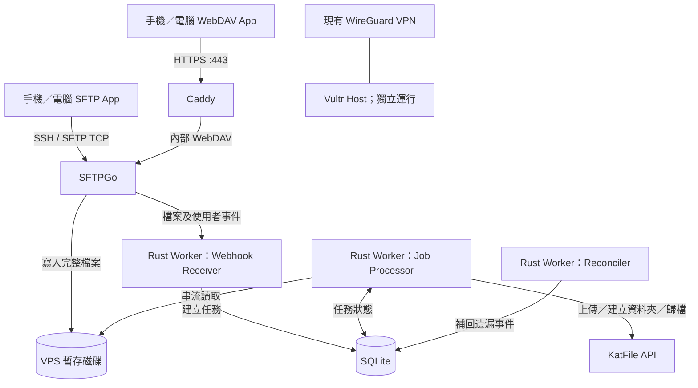
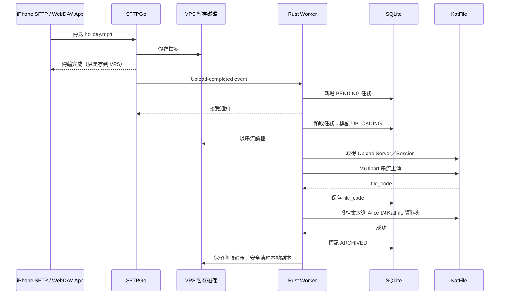
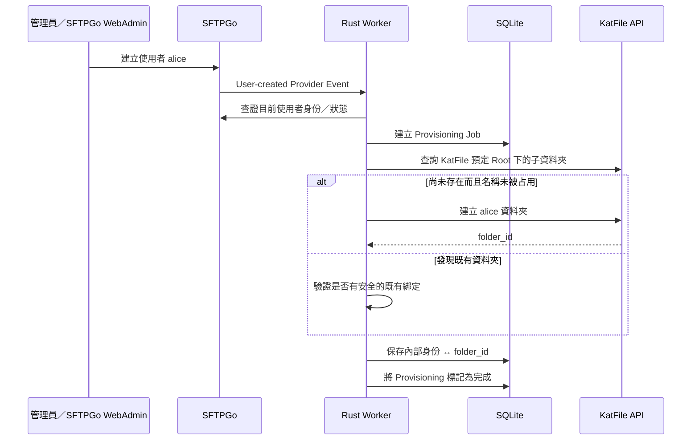

# KatFile Gateway：技術架構與運作原理

> **閱讀對象：** 想理解系統如何運作的開發者／管理者。這是技術說明，不是交給 AI Agent 的施工清單。  
> **專案狀態：** 架構設計；下文描述的是**預計實作方式**，不代表服務已部署、功能已通過驗收。  
> **部署目標：** 現有 Vultr VPS（1 vCPU、1 GB RAM、25 GB SSD），與 WireGuard VPN 共存。

## 1. 這個專案解決甚麼問題？

我希望直接使用 Android、iOS、macOS 上現成的 WebDAV／SFTP 客戶端，將文件、相片、影片上傳至自己的 **KatFile 帳戶**，毋須自行開發或上架手機 App。

同時，系統允許建立多個**獨立使用者**。例如 Alice 和 Bob 可以使用不同帳號登入，每人只看到自己的目錄。所有資料實際上仍會透過伺服器端的一組 KatFile API Key，歸檔在同一個 KatFile 帳戶下的不同資料夾。

**第一版是「上傳／歸檔閘道」（upload-first gateway），不是完整雲端硬碟。** 手機顯示「上傳成功」，代表 SFTPGo 已接收檔案，並不代表 KatFile 已成功歸檔。成功歸檔並清走本地檔案後，該檔案可能不再出現在 WebDAV／SFTP 的檔案列表中。

### 預期使用規模

| 項目 | 目標 |
|---|---|
| 每月累積上傳 | 100 GB 以下 |
| 檔案類型 | 文件、相片、影片 |
| 單一影片 | 通常不超過 10 GB |
| 身份 | 小型私人使用者群組 |
| KatFile 帳戶 | 一個，API Key 只儲存於伺服器 |
| 大型檔案同步 | 初期同時最多一項 |
| VPS | Vultr：1 vCPU／1 GB RAM／25 GB SSD；已運行 WireGuard |

## 2. 整體架構：誰負責甚麼？



| 組件 | 核心職責 | 是否自行開發 |
|---|---|---|
| **SFTPGo** | WebDAV、SFTP、帳密／SSH Key、使用者目錄隔離、WebAdmin、事件管理 | 否 |
| **Caddy** | WebDAV 的 HTTPS 入口及憑證管理 | 否 |
| **Rust Worker** | 接事件、管理待辦、呼叫 KatFile API、重試、歸檔、清理 | **是** |
| **SQLite** | 儲存持久化上傳任務及 User → KatFile Folder ID 對應 | 否；由 Worker 使用 |
| **VPS staging** | 暫存尚未成功歸檔的檔案 | 否 |
| **KatFile** | 最終遠端儲存目的地 | 外部服務 |
| **WireGuard** | VPS 原有 VPN；保留現有部署與設定 | 現有服務 |

### 為何不自己寫 WebDAV／SFTP Server？

WebDAV 涉及 HTTP Method、路徑、客戶端兼容性、身份驗證等細節；SFTP 又是另一種透過 SSH 傳輸的協定。由成熟的 SFTPGo 統一負責，可以讓 Rust 程式專心處理 **KatFile 與歸檔流程**。

## 3. WebDAV 和 SFTP 有甚麼分別？

- **WebDAV**：以 HTTP／HTTPS 為基礎；手機 App 可用 `https://dav.example.com/` 連接。經由 Caddy 反向代理到 SFTPGo。
- **SFTP**：透過 SSH 連線；使用 `sftp://host:port` 或 App 中的 SFTP 設定。**不是 FTP／FTPS**，也不是經 Caddy 的 HTTP 反向代理；要獨立的 TCP Listener。
- **相同身份及檔案視圖**：兩種協定共用 SFTPGo 的 User、Home Directory 和檔案權限。Alice 可以在同一個虛擬根目錄下選擇 WebDAV 或 SFTP。

示意連線資料（不是已部署的真實地址）：

| 設定 | WebDAV | SFTP |
|---|---|---|
| 協定 | HTTPS + WebDAV | SSH + SFTP |
| 位址 | `https://dav.example.com/` | `sftp.example.com` |
| Port | `443/TCP` | `2022/TCP`（示例，需避開主機 SSH） |
| 認證 | SFTPGo 帳密 | SFTPGo 帳密或 SSH Public Key |
| Client | 支援 WebDAV 的現成 App | 支援 SFTP 的現成 App |

## 4. Rust Worker 不是單純一個 Event Hook

可以把它看成 **事件驅動的長駐背景服務**，裡面有幾個並行工作：

1. **Webhook Receiver（Axum）**：接收 SFTPGo 通知，驗證來源，將任務寫入 SQLite，快速回應。
2. **Job Processor（Tokio）**：從 SQLite 領取工作，呼叫 KatFile API，更新任務狀態。
3. **Reconciler（定期核對）**：在 Worker 重啟、事件遺漏或網路短暫故障後，核對 SFTPGo、暫存檔案和資料庫，補回缺失任務。
4. **Admin Diagnostics**：提供健康狀態、上傳佇列及錯誤資訊（僅限管理端存取）。

SFTPGo 的 **Event Manager** 負責偵測「使用者已建立」、「檔案已上傳完畢」等事件；Worker 的 Webhook 只是接收通知的入口。**真正耗時的 10 GB 上傳不在 Webhook HTTP Request 裡面完成。**

### 為甚麼要有 SQLite Queue？

如果收到事件後立即連 KatFile，一旦 KatFile 暫時不可用，工作可能丟失。SQLite 讓待處理工作在程序崩潰、容器重啟後仍然存在。Worker 可從上次已知狀態恢復、按規則重試，而且毋須再部署 Redis／RabbitMQ。

SQLite 亦保存遠端回傳的 `file_code`：如果檔案已上傳成功，但「放入指定 KatFile 資料夾」失敗，下一次應該直接重試資料夾步驟，而不是重新上傳整條影片。

## 5. 一次檔案上傳的完整生命週期

假設 Alice 用 iPhone 上傳 `holiday.mp4`：



### 任務狀態

```text
PENDING
   ↓
UPLOADING ──出現暫時故障──→ RETRY_PENDING ──到期重試──→ UPLOADING
   ↓ 收到 file_code
ASSIGNING_FOLDER ──失敗──→ RETRY_PENDING（保留 file_code）
   ↓ 成功
ARCHIVED
   ↓ 已核實 + 超過保留期
CLEANED
```

實際系統另需表示永久失敗、手動介入、檔案缺失和取消等狀態。不要把每一種 API 錯誤都無限重試。

### 「上傳成功」有兩層意思

- **Client → SFTPGo 成功**：檔案已到達 VPS，手機傳輸可以結束。
- **Worker → KatFile 成功**：Worker 已取得遠端識別碼、完成目錄指派與必要核實；才算真正歸檔。

需要獨立的管理狀態頁／API 讓管理員知道後者是否成功。第一版用 SFTPGo WebAdmin 管理帳號，Worker API 查看工作；不必自製整套網站。

## 6. 新增使用者時，KatFile 資料夾如何建立？

新增使用者同樣使用事件機制，但事件類型不同：**Provider Event**（帳號資料異動），而不是 File System Upload Event。



### 權限隔離不是簡單靠資料夾名稱

| SFTPGo 使用者 | SFTPGo 可見的 `/` | KatFile 真實位置 |
|---|---|---|
| Alice | `/data/users/alice` | `KatFile /alice` |
| Bob | `/data/users/bob` | `KatFile /bob` |

使用者看到的是 **Virtual Root**：Alice 登入看到的 `/` 並非 VPS 的整個根目錄。SFTPGo 執行客戶端的路徑和權限隔離；Worker 另外限制遠端操作只能落在該身份已綁定的 KatFile Folder ID 及其合法子目錄。

因為 KatFile 使用 `fld_id`（資料夾）和 `file_code`（檔案），Worker 需要持久化這個映射，而不能單靠路徑字串。

**刪除再建立同名帳號是特別情況**：新 Alice 不應自動繼承舊 Alice 的 KatFile 資料夾。應記錄不可變的內部身份／代次，遇到可能重名的舊資料夾時暫停自動綁定並要求管理員核准。停用或刪除使用者時也不應直接刪除 KatFile 上的歷史資料。

若建立資料夾失敗，應顯示 `PROVISIONING_FAILED` 或待重試狀態，**不得把檔案誤送到 KatFile Root 或其他人的資料夾**。

## 7. KatFile API 在其中扮演甚麼角色？

KatFile 的 API 將「伺服器上某個檔案」轉成 KatFile 平台內的檔案識別碼，而不是像本地檔案系統一樣直接操作路徑。

預計使用的主要操作包括：

| 操作 | 候選 KatFile API |
|---|---|
| 驗證帳戶 | `/api/account/info` |
| 列出檔案 | `/api/file/list` |
| 列出資料夾 | `/api/folder/list` |
| 建立資料夾 | `/api/folder/create` |
| 選擇上傳伺服器 | `/api/upload/server` |
| 上傳內容 | API 回傳的 Upload CGI URL |
| 移動到使用者資料夾 | `/api/file/set_folder` |
| 取得檔案資訊 | `/api/file/info` |
| 取得直接下載連結（未來） | `/api/file/direct_link` |

**注意：** 以上整理自 XFileSharing Pro／KatFile 相關 API 資料；KatFile 實際部署是否支援所有 Endpoint、欄位及權限，仍須以 V0 實測為準。尤其要檢查 `folder/create`、`set_folder`、大量檔案分頁及 10 GB multipart 上傳。

還需要驗證 KatFile Upload CGI 是否接受 chunked transfer。如果不接受，必須使用**能預先計算 Content-Length 的定長 multipart 串流**；不能將整個 10 GB 檔案載入記憶體。

### 為何仍可能出現重複檔案？

假設 KatFile 已收下 10 GB 檔案，但網路在回傳 `file_code` 前中斷。Worker 無法確定遠端到底有沒有成功，重試可能產生第二份檔案。若 KatFile 不支援 Idempotency Key 或可靠查找機制，就無法保證嚴格的 exactly-once 上傳。應記錄檔案指紋、任務 ID、時間與錯誤，遇到不確定結果先嘗試對帳，必要時人工處理。

## 8. 10 GB 影片如何在 1 GB RAM VPS 上處理？

**關鍵是分段讀寫（streaming），不是把檔案全部載入 RAM。**

手機先將檔案寫到 VPS 的實體暫存磁碟；Worker 再從該檔案逐塊讀取，經 `reqwest` 送往 KatFile。Rust 的 `tokio` 負責非同步 I/O，不需要開一條 Thread 或複製整份檔案到記憶體。

可能使用的 Rust 組件：

- `tokio`：非同步 Runtime、檔案讀取、工作排程。
- `axum`：接收 SFTPGo Webhook、提供內部診斷 API。
- `reqwest`：KatFile REST API 及 multipart HTTP Client。
- `serde`：JSON 模型解析。
- `sqlx` + SQLite：持久化任務與映射。
- `tracing`：結構化日誌及錯誤追蹤。

這是運行在 Linux 的一般 Rust 程式，**使用 `std`，不需要 `no_std`**。

### 25 GB SSD 的真正限制

1 GB RAM 可以依靠串流降低消耗，但**串流不能減少暫存檔案本身的磁碟容量**。

例如一條 10 GB 影片在等待 KatFile 上傳時，通常至少要佔用約 10 GB 的 VPS staging。25 GB SSD 還要分給 OS、WireGuard、容器映像、SQLite、日誌及安全預留，不能假設全部可用。

系統因此需要：

- 磁碟高水位保護及安全保留量（計劃目標約 3–5 GiB，按實際測量調整）。
- 一次只進行一項大型 KatFile 歸檔。
- 區分「客戶端正在寫入」與「已完成、可以歸檔」的檔案。
- 在容量不足時**預先拒絕或限制新的上傳**，而非耗盡整台主機磁碟。
- 成功歸檔及核實後才清理；失敗任務不能任意刪除。

**重要限制：** 若 SFTPGo 把完整上傳先寫入磁碟，Worker 的並行限制並不會自動限制多位 Client 同時佔用 staging。必須另外設定上傳配額、最大檔案大小／連線數，以及磁碟容量防護。對 25 GB SSD 而言，能否可靠處理 10 GB 檔案是 V3 實機驗收的重點，不是設計上必然保證。

## 9. WireGuard 和新服務如何共存？

WireGuard 現時是 Vultr VPS 的主要用途，**不能為了 Gateway 破壞 VPN**。

```text
Vultr Host
├── WireGuard（保持現有 UDP Port、介面、路由及 NAT）
├── Caddy（可能公開 443/TCP → WebDAV）
├── SFTPGo（WebDAV 內網；SFTP 用獨立 TCP Port）
├── Rust Worker（內部 Webhook／Job Processor）
├── SQLite
└── VPS Staging
```

- WebDAV 通常走 `443/TCP`，WireGuard 使用其現有的 UDP Port，兩者協定及 Port 通常不同。
- SFTP 另設 TCP Port，例如 `2022`；正式選定前要檢查主機原有 SSH 服務及 Firewall。
- SFTPGo WebAdmin、Worker API 應僅供 WireGuard VPN 或 SSH Tunnel 存取，不公開管理入口。
- Docker 可能更改主機 `iptables`／`nftables`；上線前先檢查現有 WireGuard 的 Forwarding、NAT 和路由，並準備回滾方法。
- 監控 WireGuard 延遲、可用性，以及上傳對 CPU、RAM、磁碟 I/O 和 Vultr 網絡配額的影響。

**部署策略：** 先在 Mac／本地 Docker 完成 API 驗證和功能測試；正式部署 Vultr 前另外備份現有 WireGuard 設定、確認可用的 Out-of-band／Vultr Console 存取方式。不要在未確認回滾能力前修改防火牆規則。

## 10. 管理入口：Web Portal 與 API

第一版建議保持管理功能分工，不重造完整網站：

| 功能 | 入口 |
|---|---|
| 新增／停用／刪除使用者 | SFTPGo WebAdmin |
| 設定帳密、SSH Key、目錄與權限 | SFTPGo WebAdmin 或官方 REST API |
| 自動建立 KatFile 專屬資料夾 | Rust Worker 接 Provider Event |
| 查看使用者與 KatFile Folder ID 綁定 | Worker Admin Diagnostics API |
| 檢視失敗、重試、已歸檔任務 | Worker Admin Diagnostics API |
| 恢復失敗任務 | 受管理員保護的 Worker API |

未來若想有一個整合 Dashboard，再另外加入很輕量的頁面即可。**不需要為了最初版本而開發另一套使用者登入系統。**

## 11. 故障會發生在哪裡？

| 狀況 | 預期行為 |
|---|---|
| KatFile 暫時不能連線 | SQLite 任務保留，稍後重試 |
| Worker 容器重啟 | 重新領取可恢復的工作；核對中途狀態 |
| SFTPGo Webhook 遺漏 | Reconciler 掃描補回已完成的上傳 |
| 新使用者資料夾建立失敗 | 不歸檔至錯誤目錄；標示 Provisioning Pending／Failed |
| KatFile 檔案已上傳，但設資料夾失敗 | 保留 `file_code`，只重試 Folder Assignment |
| KatFile 已上傳，卻沒有回傳 `file_code` | 記錄不確定狀態，對帳／人工處理，避免盲目重傳 |
| VPS 磁碟快滿 | 停止接納新大型上傳，保住 WireGuard／OS 運作 |
| 同名使用者刪除後重建 | 不自動繼承舊資料夾，需重新核准 |
| 使用者在歸檔途中修改／刪除檔案 | 檢查檔案身份、大小／版本，避免上傳或清理錯誤版本 |

## 12. 系統在哪些地方需要特別注意安全？

- **唯一 KatFile API Key**：只存在 Worker 的安全設定，不送到 App，也不寫入 Git、日誌或公開 API。
- **SFTPGo 處理使用者權限**：每位使用者只看見自己的 Virtual Root；Worker 再獨立核對來源與遠端 Folder Mapping。
- **Webhook 不是可信指令**：即使來自內部網絡，仍要驗證認證、使用者、路徑、檔案身份和事件重放。
- **避免競爭條件**：歸檔時不得因檔案被替換而讀取或刪除錯誤內容。
- **清理需最小權限**：Worker 優先以受限制方式通知 SFTPGo 或專用清理組件清理，避免 Worker 任意寫入所有使用者路徑。
- **管理入口不直接公開**：經 VPN／SSH Tunnel 管理，並使用額外認證。
- **加密傳輸**：WebDAV 必須使用 HTTPS；SFTP 自帶 SSH 加密。對 KatFile API 優先使用 HTTPS 並驗證 TLS。

## 13. 為甚麼選 Rust？

你的 VPS 只有 1 GB RAM，Rust 在這個場景有實際優勢：可用少量記憶體實作 HTTP Server、Background Queue 和大檔串流，亦毋須 JVM 常駐記憶體。Rust 的型別系統可以幫助把遠端 API、狀態轉移、重試邏輯寫得清晰。

不過 Rust 不是魔法：磁碟容量、網絡頻寬、KatFile 限流、API 行為及暫存檔保留政策，仍然是整體可靠性的關鍵。

### 預計 Crate 分層

```text
Cargo Workspace
├── katfile-api
│   ├── KatFile HTTP Client
│   ├── Upload / File / Folder API
│   └── Request / Response Models
└── katfile-worker
    ├── Axum Webhook / Admin Routes
    ├── Event Validation
    ├── SQLite Job Repository
    ├── Tokio Job Runner
    ├── Reconciliation
    └── Retention / Cleanup
```

拆開 `katfile-api` 的好處是未來若加入下載、遠端目錄管理，或改用其他前端，API Client 可以重用。

## 14. 開發與部署階段：用來理解進度

| 里程碑 | 核心目標 | 你能看到的成果 |
|---|---|---|
| **V0** | 實測 KatFile API、Folder Mapping、串流上傳相容性 | 小檔／大檔可正確上傳與歸檔 |
| **V1** | 本地 SFTPGo：WebDAV + SFTP + 多使用者隔離 | 手機／電腦兩種協定可連線，互相看不到其他帳戶 |
| **V2** | Rust Worker：Event、SQLite Queue、User Provisioning、Retry | 新增使用者自動建 KatFile 目錄；上傳後自動歸檔 |
| **V3** | 在現有 Vultr VPS 部署與驗收 | 可靠處理實際檔案，且 WireGuard 未受影響 |

具體工程任務、測試和部署前授權，以另一份 `KATFILE_WEBDAV_GATEWAY_IMPLEMENTATION_PLAN.md` 為準。

## 15. 當前限制與未來可能方向

第一版**不保證**：

- KatFile 已歸檔檔案會永久出現在 WebDAV／SFTP 列表。
- 使用者能像本地磁碟一樣移動、覆寫、刪除已歸檔檔案。
- 所有遠端上傳必定「恰好一次」，不產生任何重複。
- 25 GB SSD 可容納多位使用者同時提交多條 10 GB 影片。

未來可考慮：KatFile 目錄 Metadata Cache、按需下載、完整雙向檔案管理、整合 Admin Dashboard、使用者通知、多重儲存後端等。但每增加一項，都會讓「上傳閘道」更接近需自行維護完整檔案系統的產品。

## 16. 一句話理解整個專案

> **SFTPGo 是入口和守門員；Rust Worker 是負責歸檔的物流系統；SQLite 是不會因重啟而消失的工作清單；KatFile 是最終倉庫；Vultr 是轉運站，而 WireGuard 是必須保持正常的既有服務。**

---

## 參考資料

- [SFTPGo 官方文件](https://docs.sftpgo.com/)
- [SFTPGo 專案](https://github.com/drakkan/sftpgo)
- [XFileSharing Pro API Reference](https://xfilesharingpro.docs.apiary.io/#reference/account/account-info)
- [KatFile API 文件入口](https://katfile.biz/)
- [Tokio](https://tokio.rs/)
- [Axum](https://docs.rs/axum/)
- [Reqwest](https://docs.rs/reqwest/)
- [SQLx](https://docs.rs/sqlx/)
- [Caddy](https://caddyserver.com/docs/)
