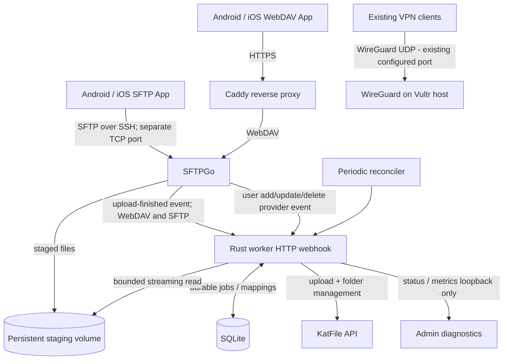
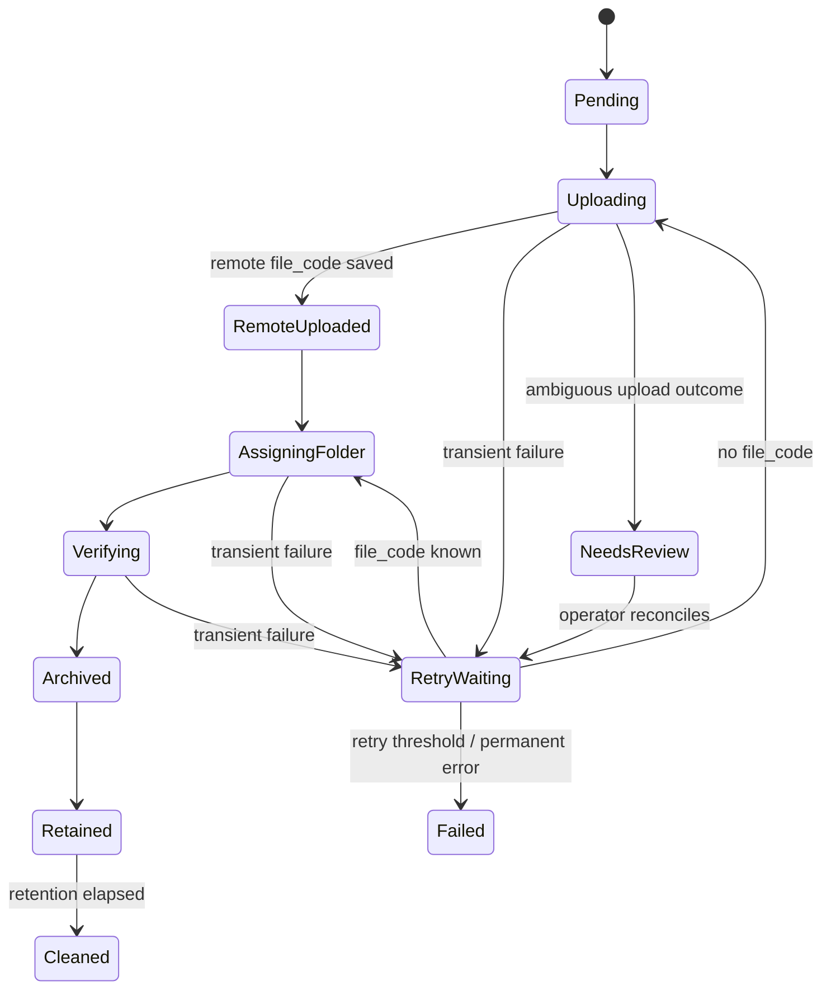

# KatFile WebDAV Gateway — Implementation Plan

> **Execution specification for Codex / Claude Code / AI coding agents**  
> Version: 1.2 · Scope: V0–V3 · Language: Rust · Deployment: Docker Compose on existing Vultr VPS (WireGuard coexistence)

## 0. Agent execution instructions

Build an **upload-first**, multi-user WebDAV/SFTP-to-KatFile gateway. Follow V0 → V1 → V2 → V3 in order. **Do not claim any step completed without its acceptance checks passing.** Preserve existing project changes; never commit `.env`, credentials, local data, or real uploaded content. Ask before production deployment, changing DNS, opening firewall ports, changing routing/VPN configuration, creating billable infrastructure, or using a real account for potentially destructive API tests. **Never disrupt the existing WireGuard service.** Provide changes, validation evidence, remaining limitations, and required operator steps at every milestone.

Technical selections: **SFTPGo** (WebDAV + SFTP, shared user identities and home isolation), **Caddy** (HTTPS), **Rust worker** (`tokio`, `axum`, `reqwest`, `serde`, `sqlx`/SQLite, `tracing`), Docker Compose. **No custom mobile app and no custom WebDAV protocol implementation.** Use stable Rust `std`, not `no_std`. Pin tested dependency and container versions rather than floating `latest` in production.

**Critical distinction:** A successful WebDAV `PUT` or SFTP file transfer means SFTPGo accepted data to staging, **not** that KatFile archival is complete. V1 is **not a two-way cloud drive**: archived files may vanish from WebDAV when the local copy is retired. Make this clear in the README and operator-facing status UI/API.

## 1. Goals and workload

| Requirement | Target |
|---|---|
| Client | Existing Android/iOS WebDAV-capable or SFTP-capable apps; no custom mobile app |
| Protocols | WebDAV over HTTPS and SFTP over SSH; same home/permissions and upload pipeline |
| User provisioning | Create SFTPGo user → automatic private KatFile folder provisioning and durable ID mapping |
| Remote destination | One private KatFile account, using API key server-side |
| User access | Multiple WebDAV users; separate home directories and KatFile root folder per user |
| Workload | Under 100 GB uploads/month; documents, photographs, videos usually <= 10 GB each |
| Concurrency | One large KatFile upload worker initially; configurable limit |
| Infrastructure | **Existing Vultr VPS**: 1 vCPU, 1 GB RAM, 25 GB SSD; shared with running WireGuard VPN |
| Incremental cost target | US$0/month in new VPS rental, **only if** existing storage, RAM and Vultr transfer quota suffice |
| VPN preservation | Existing WireGuard configuration, interfaces, firewall/NAT, forwarding and client connectivity must remain functional |
| Environment | Start on macOS / Docker locally; inspect existing Vultr OS and runtime before an explicitly approved deployment (do not assume Ubuntu) |
| Persistence | SQLite job database plus files in persistent volumes |
| Storage model | Local staging → async KatFile archive → verified retention-based local cleanup |

### Out of scope for V0–V3

- Browsing all historical KatFile account files over WebDAV after local cleanup.
- Bidirectional synchronization / offline conflict resolution.
- Remote rename/delete semantics after a file has been archived.
- Real-time shared folders or end-user KatFile login.
- Public registration, paid plans, quota billing, mobile app publication.
- Promising crash-proof *exactly-once* remote uploads (KatFile API may not support idempotency).

## 2. Architecture



### VPS coexistence boundary

The host already runs **WireGuard VPN**. WireGuard stays in place and is not containerized or migrated as part of this project. Preserve its real configured UDP port (do not assume `51820`), `wg*` interface, routes, forwarding/NAT, firewall, DNS and client profiles. Container networking and published ports must be evaluated for interaction with WireGuard (Docker can modify `iptables`/`nftables` rules). Do not run broad firewall resets or replace existing routing tables.

### Trust boundaries

- Caddy exposes public HTTP(S) only if approved; terminate TLS on 443 and redirect 80 to HTTPS. SFTP is a separate TCP listener and does not pass through Caddy. Decide whether to expose SFTP publicly or only on WireGuard.
- SFTPGo WebDAV stays on the private Docker network. Admin UI bound to loopback or accessible only through VPN / SSH tunnel.
- Worker webhook/status never publicly exposed. Authenticate webhook even on the internal network.
- KatFile API key belongs only to Worker, injected as a secret at runtime (not in images or Git).
- SFTPGo runs with non-root privileges; worker should have **read-only staging** access where feasible. Cleaning files requires a deliberate protected mechanism (e.g., a scoped SFTPGo API call or a dedicated narrowly-permissioned cleanup component), **not** uncontrolled writable access.
- Worker must validate user identity, canonical paths, folder mappings, symlinks, and file identity. A webhook payload is untrusted input, even if signed.

## 3. Repository layout

```text
katfile-webdav-gateway/
├── README.md
├── .gitignore
├── .env.example
├── compose.yaml
├── Cargo.toml                    # Cargo workspace
├── Cargo.lock
├── crates/
│   ├── katfile-api/
│   │   ├── Cargo.toml
│   │   └── src/{lib,client,models,upload,folder,error}.rs
│   └── katfile-worker/
│       ├── Cargo.toml
│       ├── Dockerfile
│       ├── migrations/
│       └── src/{main,config,webhook,queue,runner,db,paths,reconcile,cleanup,status}.rs
├── config/
│   ├── caddy/Caddyfile
│   └── sftpgo/                   # version-pinned, verified settings / provisioning
├── scripts/
│   ├── smoke-test.sh
│   ├── restore-test.sh
│   └── api-probe.sh
├── docs/
│   ├── ARCHITECTURE.md
│   ├── API_COMPATIBILITY.md
│   ├── SECURITY.md
│   ├── DEPLOYMENT.md
│   ├── OPERATIONS.md
│   └── ACCEPTANCE.md
└── tests/
    ├── fixtures/               # synthetic payloads only
    └── integration/
```

`.gitignore`: `.env`, `*.db*`, `/data/`, `/secrets/`, large test artifacts, logs, local compose overrides, temporary files. Never use a repository directory as production upload storage.

## 4. Identity and directory model

Example mapping:

| WebDAV username | Visible root | SFTPGo physical root | KatFile root folder ID |
|---|---|---|---|
| alice | `/` | `/srv/sftpgo/data/alice` | configured `folder_id_A` |
| bob | `/` | `/srv/sftpgo/data/bob` | configured `folder_id_B` |

KatFile root IDs must come from **actual** API responses, not hardcoded examples. Each user's nested relative path (`/photos/2026/img.jpg`) maps to folders created/resolved only below that user's KatFile root. Store remote folder ID mappings in SQLite. Do not assume remote folder names are globally unique.

### Automatic user provisioning (mandatory in V2)

**SFTPGo is the source of truth for user accounts.** The Worker automatically provisions a dedicated folder under the KatFile account root when SFTPGo creates a user. SFTPGo Provider Event `add` on object `user` should invoke an authenticated internal Worker endpoint; verify that the chosen SFTPGo Open Source release supports the selected event action. A periodic reconciler must also recover missed notifications.

1. Receive the provider event and authenticate it; do not trust the event's username alone. Query SFTPGo's protected Admin REST API or otherwise verify an authoritative active user record.
2. Use an internal immutable `principal_id` / provisioning-generation identifier, not only the username, so deleted-and-recreated usernames do not silently inherit historical access. Explicitly document how to bind SFTPGo's stable identity; if no suitable stable immutable ID exists, maintain a Worker-generated generation with a tombstone and require administrator approval before name reuse.
3. Check the durable SQLite mapping, then list direct KatFile root subfolders (`fld_id=0`, or actual API equivalent), ensuring uniqueness.
4. If the folder does not exist, call the verified KatFile folder-create API with `parent_id=0` and `name=<validated username>`, then read back the folder ID. If the API result is uncertain (timeout after request), **re-list before retrying creation** to avoid duplicates.
5. Persist `principal_id`, username, KatFile folder ID, provisioning state and timestamps transactionally. For new accounts, require successful mapping before allowing their uploads to be archived (jobs remain safely queued).
6. On update/disable, re-check authoritative user state and block new archival for disabled users; preserve existing files/mappings. On delete, tombstone the mapping without deleting KatFile folders/files. A recreated username is a new principal and must never silently reuse the old folder, even if the same name exists in KatFile. Require explicit administrator resolution or a safe unique remote naming policy.
7. Provide local/VPN-only admin diagnostics showing `Provisioning`, `Active`, `Failed`, `Disabled`, `Deleted` and retry/reconcile status; no second full user-management portal is needed (use SFTPGo WebAdmin).

**Important:** the folder naming default is the exact validated username; reject or canonicalize unsupported/ambiguous KatFile names, and handle duplicates/case-folding/Unicode safely. Username-to-folder relations are an isolation boundary; never automatically attach a folder purely because a name matches when ownership is ambiguous.


### Authorization tests

- Alice can `PROPFIND`, `MKCOL`, and `PUT` within Alice's root.
- Alice cannot list/read/write Bob's home using `../`, encoded segments, unusual Unicode, or WebDAV `MOVE`/`COPY` destination headers.
- Worker may not archive a file against another user's KatFile folder ID, even with forged payloads.
- Symlinks, concurrent modification, file replacement, and duplicate filenames must not bypass isolation.
- One KatFile account **does not** provide independent KatFile-side user authorization; per-user separation is enforced by gateway and server admins/key-holders retain full access.

## 5. KatFile API contract and compatibility

Source: [XFileSharing Pro API reference](https://xfilesharing.com/pages/api) and [Apiary reference](https://xfilesharingpro.docs.apiary.io/). **These are generic upstream specifications; verify each endpoint and response against KatFile's actual host/configuration.**

| Operation | Candidate endpoint | Required in V0? |
|---|---|---|
| Account validation | `GET /api/account/info` | Yes |
| List files | `GET /api/file/list` | Yes |
| List folders | `GET /api/folder/list` | Yes |
| Create folder | `GET /api/folder/create` (actual method/fields to verify) | Yes |
| Request upload server | `GET /api/upload/server` | Yes |
| Upload binary | Upload server's returned CGI URL, `sess_id`, `utype`, `file_0` multipart | Yes |
| Set destination folder | `GET /api/file/set_folder` | Yes |
| Verify file | `GET /api/file/info` or equivalent | Yes |
| Direct download link | `GET /api/file/direct_link` | Optional future |

### V0 contract tests

1. Read API key from environment/secret store. Never paste it in test output, shell trace, exception logging, URLs in telemetry, or committed fixtures.
2. Call account info and check **both** HTTP status and JSON application-level `status`/`msg`.
3. List root files/folders, confirm pagination and unknown folder behavior.
4. Create a dedicated disposable test folder under an operator-approved account location.
5. Upload a **small synthetic** file using the two-step upload protocol.
6. Set destination folder and verify via listing or file info; confirm file size and identity.
7. Test rejected/expired key, malformed JSON, timeout, upload server failures and duplicate filename behavior.
8. **Probe multipart streaming**: some upload servers may require a known `Content-Length`; establish whether transfer-encoding chunked works and fall back to precomputed multipart length without buffering the whole file.
9. **Probe HTTPS support** for returned upload endpoint: API examples sometimes return `http://.../cgi-bin/upload.cgi`. Do not send sensitive upload session data or files over plaintext in production without explicit review. Prefer provider-supported HTTPS; do not silently rewrite the URL unless tested.
10. Validate any returned upload host against a constrained trusted hostname pattern and permitted ports before making requests; block arbitrary IPs, loopback and private networks to prevent SSRF.
11. Record verified parameters, payload shapes, file-size limits, rate limits (if observed), and feature gaps in `docs/API_COMPATIBILITY.md`.

**Stop gate:** If KatFile cannot securely and reliably upload a 10 GB file, report this as a blocker; do not proceed to an unsupported production claim. Small-file POC can still continue with explicit limitations.

### Rust API client

- Dedicated `katfile-api` library with typed DTOs and domain-specific errors.
- `reqwest` client with connection pooling, separate connect / total timeouts and conservative retries.
- `serde` for JSON; handle `result` variants defensively and preserve sanitized diagnostics.
- Stream local file in bounded chunks; avoid `read_to_end()` and buffering multipart payloads.
- Configurable upload base URL/allowed hostnames. Verify redirects cannot bypass the allowlist or downgrade to HTTP.
- Test against a mock HTTP server (no real API key in CI).

## 6. Durable upload state machine



### SQLite minimum schema

- `users`: gateway user ID, SFTPGo username, remote root folder ID, enabled flag.
- `folder_mappings`: user ID, normalized relative folder path, KatFile folder ID, timestamps, uniqueness constraints.
- `upload_jobs`: stable job ID, user ID, normalized virtual path, local path reference, size, mtime/file identity, optional content hash, state, remote file code, folder ID, attempt count, next retry, timestamps, last sanitized error.
- `upload_attempts`: job ID, stage, start/end, sanitized error category, result metadata.
- `cleanup_jobs` or cleanup state field: retention deadline, cleanup confirmation, failure reason.

Use SQLite WAL where suitable, explicit transactions and migrations. Treat durable event insertion and state transitions as idempotent. Define uniqueness using a stable event/file-generation key rather than **path alone**, because a user may replace a file at the same path.

### Retry rules

- Backoff with jitter for connection errors, `429`, and transient `5xx` (if documented/observed).
- No automatic repeat upload after ambiguous timeout **if provider might have accepted the file**: reconcile by safe listing/identifiers or mark `NeedsReview`; never promise exactly-once remote upload without API-side idempotency.
- Once `file_code` is committed, **do not re-upload** merely because folder assignment failed.
- Permanent auth / bad input / policy errors require intervention.
- Keep local content until remote archive verified and local cleanup is safe.

## 7. Events, file consistency and cleanup

1. Configure SFTPGo **upload completion** event for both **WebDAV and SFTP** (not upload start). Check actual Event Manager capabilities in the selected **Open Source edition**; do not rely on Enterprise-only actions.
2. Send a bounded minimal payload (authenticated internal HTTP) or have the Worker query SFTPGo for authoritative file metadata.
3. Immediately record a durable `Pending` job; return success only after SQLite commit, not after remote upload.
4. Worker resolves user-relative path, refuses traversal and symlinks, verifies expected file size/identity, then processes.
5. Define behavior when user overwrites/deletes/renames local file before archival: use a private immutable spool snapshot, SFTPGo rename-to-internal-spool operation, or enforce an upload-only Inbox policy until archival; **implement and test one approach**, not a race-prone path read.
6. Periodic reconciler scans pending/staged files and detects missed events; use checkpointed scan and avoid rediscovering already-archived content.
7. Cleanup must be state-gated (`Archived` + verified + retention elapsed + stable identity), crash-safe and idempotent. **Never delete failed, retrying, or ambiguous files automatically.**
8. Prefer a protected internal spool, separate from WebDAV-visible area, to prevent clients overwriting files during transfer. Ensure users cannot browse other users' spools.

### Resource safeguards (shared Vultr: 1 vCPU / 1 GB / 25 GB SSD)

- Default maximum concurrent KatFile uploads: `1`, and limit inbound large WebDAV uploads when staging space is insufficient. This does **not** limit WireGuard traffic.
- Set conservative container memory ceilings and Rust HTTP concurrency; avoid swap thrashing that increases VPN latency. Measure resident memory for WireGuard + Docker daemon + Caddy + SFTPGo + Worker + OS before accepting production traffic.
- Give WireGuard priority under load; cap Worker CPU / concurrent uploads / transfer bandwidth if VPN latency rises. Record normal VPN latency/throughput as a baseline.
- Configure per-user quotas and system-wide free-space watermark. Admission requires **expected file size + safety reserve**, not a constant threshold alone. For a 10 GB file, target at least ~10 GB free plus a measured OS/DB/log safety reserve (initially 3–5 GiB); account for other inflight and pending uploads. Unknown-length transfers need a strict quota/streaming cutoff and cleanup behavior.
- Reserve OS/containers/logs/SQLite overhead; **measure actual free space** rather than assuming a guaranteed 15–18 GB staging capacity.
- Ensure no second 10 GB duplicate is created during spool moves or retries; prefer atomic same-filesystem rename when suitable.
- Set bounded request bodies, webhook payload limits, upload timeouts appropriate for large transfers, and log rotation.
- Expose disk pressure and queue depth. Prefer a controlled WebDAV error on insufficient capacity rather than filling the root filesystem.

## 8. Configuration

Example `.env.example` (placeholder values only):

```dotenv
# Domain
DAV_DOMAIN=dav.example.com

# KatFile (place real API key in protected secret store, never Git)
KATFILE_API_BASE_URL=https://katfile.biz
KATFILE_API_KEY_FILE=/run/secrets/katfile_api_key
KATFILE_UPLOAD_CONCURRENCY=1

# Worker
WORKER_BIND=0.0.0.0:8090
WORKER_DB_PATH=/var/lib/katfile-worker/worker.db
WORKER_STAGING_ROOT=/data/users
WORKER_RETRY_MAX=8
WORKER_RETENTION_HOURS=24
WORKER_MIN_FREE_BYTES=4294967296
# Enforce per-upload required_free >= declared_file_size + reserved bytes,
# including concurrent staging; value above is illustrative 4 GiB reserve.
WORKER_MAX_ACTIVE_KATFILE_UPLOADS=1
WORKER_WEBHOOK_SECRET_FILE=/run/secrets/worker_webhook_secret
RUST_LOG=info
```

Use a secret file or Docker secrets with strict permissions. `.env.example` is illustrative: confirm actual Compose variable mapping and Rust parsing. Use separate secrets for SFTPGo admin access, WebDAV users, Worker webhook, and KatFile.

## 9. Docker Compose / networking requirements

Services:

- `caddy`: ports `80` and `443` **only after verifying they are unused and approving public access**; HTTPS reverse proxy for WebDAV. Alternative for private-only POC: bind to WireGuard IP / loopback and use an existing certificate/SSH tunnel plan.
- `sftpgo`: private WebDAV listener; WebAdmin loopback/VPN only; persistent data provider and home volumes.
- `katfile-worker`: no public port; internal authenticated webhook and admin diagnostics; persistent SQLite directory; constrained staging mount.

Implement `compose.yaml` with pinned image versions/digests, restart policies, health checks, sensible memory/CPU limits, volume permissions, non-root users and explicit private network. Confirm compatible CPU architecture. **Do not use `network_mode: host`, `privileged: true`, or broad port publishing without justification.** Verify Docker network creation does not alter WireGuard connectivity or bypass the existing VPN firewall policy.

**Important:** SFTPGo Event Manager features, file paths, env variable names and WebDAV bindings differ by version/edition. Verify against selected version's **Open Source** documentation before writing configuration. Do not assume that Enterprise documentation applies unchanged. Test a real `PUT` → event → Worker notification end-to-end.

Caddy must support WebDAV methods such as `PROPFIND`, `PUT`, `MOVE`, `MKCOL`, `LOCK`, `UNLOCK` without dropping relevant headers. Avoid proxy body buffering that requires local duplicate storage. Set timeouts for long uploads.

## 10. Implementation milestones

### V0 — KatFile API and streaming feasibility

**Tasks**

- Create Cargo workspace and typed `katfile-api` crate.
- Write opt-in CLI or integration probe against real KatFile account using secret API key.
- Validate file listing, folder listing/creation, two-step upload, folder assignment and verification.
- Verify chunked vs known-length multipart, HTTPS upload endpoint compatibility, redirects, large-file and timeout behavior.
- Add mock-server tests and API compatibility document.

**Acceptance**

- [ ] Small test file arrives in designated KatFile folder with correct metadata.
- [ ] API key stays out of logs, Git and CI.
- [ ] Streaming memory use is bounded for a large synthetic file.
- [ ] Errors have typed/sanitized reporting.
- [ ] Any 10 GB or HTTPS limitations documented explicitly.

### V1 — Local SFTPGo WebDAV + SFTP and isolation

**Tasks**

- Implement Docker Compose for SFTPGo and local-only development access.
- Configure two synthetic users (`alice`, `bob`) with independent homes and quotas.
- Enable SFTP listener and WebDAV listener with the same SFTPGo user accounts, virtual homes and permissions. Test `sftp -P <configured-port>` and WebDAV `curl` locally; test suitable mobile clients if available.
- Keep host OpenSSH management on its existing port (normally 22/TCP, but inspect rather than assume). Use a separate configurable SFTPGo port (e.g. `2022/TCP`, only if free). Verify server SSH host-key persistence and fingerprint checking, and use SSH public keys where clients permit.
- Implement/authenticate upload completion event transport to mock Worker endpoint.

**Acceptance**

- [ ] Alice and Bob can upload/list within their isolated homes over **both WebDAV and SFTP**, with the same permissions.
- [ ] Cross-user traversal, `MOVE`, `COPY` attempts fail.
- [ ] 10 GB upload succeeds locally when available disk permits, otherwise is rejected safely.
- [ ] Event is delivered only on completed upload.
- [ ] Service restart preserves users and files.

### V2 — Rust Worker integration

**Tasks**

- Implement `axum` webhook with authentication and payload validation.
- Implement SQLite migrations, durable queue, job processing and retries.
- Implement authenticated SFTPGo **Provider Event user creation** handling and automatic KatFile root folder provisioning, with durable per-principal mapping and strict username-reuse handling.
- Implement secure per-user KatFile folder mapping and nested folder creation; startup/periodic SFTPGo user reconciliation, failed-provision retries and management diagnostics.
- Verify SFTPGo `add` / `update` / `delete` provider events against pinned Open Source edition; fallback to reconciler if relevant event action is unavailable.
- Implement bounded streaming to KatFile, remote file ID persistence, assignment and verification.
- Implement reconciliation for missed events and ambiguous upload outcomes.
- Implement safe cleanup with configurable retention and disk pressure rules.
- Add local-only status endpoints or simple authenticated diagnostics for counts, per-job statuses and retries; no public status page by default.

**Acceptance**

- [ ] Creating Alice and Bob in SFTPGo WebAdmin automatically creates two distinct KatFile root folders and persists their returned IDs without manual mapping.
- [ ] SFTPGo WebAdmin/API is the user-management portal; no custom user portal is required.
- [ ] Provider-event replay and Worker downtime recover by idempotent reconciliation without duplicate KatFile folders.
- [ ] Failed provisioning is visible; files remain queued until the mapping succeeds.
- [ ] Disable/delete prevents unintended new archives while preserving remote content; username reuse cannot inherit old folder access.
- [ ] Alice file archived only under Alice's KatFile root; Bob under Bob's, regardless of WebDAV or SFTP client.
- [ ] Restart while uploading recovers without silent data loss.
- [ ] Folder assignment failure retries without re-uploading when `file_code` is known.
- [ ] Duplicate events do not create duplicate jobs.
- [ ] Ambiguous provider outcome is flagged instead of blindly re-uploaded.
- [ ] Failed/unfinished files are never auto-deleted.
- [ ] SQLite backup/restore procedure tested.

### V3 — Vultr deployment, WireGuard coexistence and operational acceptance

**Tasks**

- Add Caddy HTTPS, production Compose profile and deployment documentation.
- Run full stack locally, then (only with operator approval) deploy to the **existing Vultr VPS**.
- Run host preflight and record current WireGuard baseline, interface/ports, firewall/NAT, forwarding, routing, CPU, RAM, disk and plan transfer quota. **Read-only audit first.**
- Check existing services/ports and decide whether to expose WebDAV TCP 80/443 and SFTPGo SSH/SFTP (e.g. TCP 2022) publicly or via WireGuard only; preserve existing host SSH and WireGuard UDP ports. Add narrow inbound firewall rules only with operator approval; do not route SFTP through Caddy.
- Review Docker firewall interactions and apply only narrowly scoped, reversible firewall/DNS/TLS changes after approval. Never flush or replace firewall rules.
- Keep all new HTTP admin endpoints private, ideally reachable via existing WireGuard VPN or SSH tunnel.
- Define a remote-console/SSH rollback route in case deployment unexpectedly affects VPN.
- Secure admin endpoints and credentials; configure backup and monitoring.
- Test real mobile WebDAV **and SFTP** upload of documents, photos, and a video near 10 GB if feasible; verify same archive behavior and account isolation across both protocols.
- Test restart, KatFile outage, network interruption, full disk rejection, webhook replay and user isolation.
- Document how to inspect queue, retry failures, rotate key, recover backups and upgrade containers.

**Acceptance**

- [ ] TLS is valid and a mobile WebDAV app connects; SFTP client connects over the configured SSH/SFTP TCP port and validates the persistent server host key.
- [ ] WebDAV `PUT` success is clearly distinguished from KatFile archive completion.
- [ ] Real test files are verified in correct remote folders.
- [ ] No WebAdmin / Worker endpoints exposed to internet.
- [ ] Worker keeps bounded RAM and disk usage under target VPS constraints.
- [ ] Cleanup only removes verified archived data after retention.
- [ ] Backup restore and restart recovery tested.
- [ ] **WireGuard still works from an external VPN client** before, during and after deployment: handshake, connectivity, DNS (if used), internet egress, and latency/throughput show no unacceptable regression.
- [ ] Docker/SFTPGo/Caddy/Worker restarts do not break WireGuard interfaces, firewall/NAT or routes.
- [ ] VPS stays within practical 1 GB RAM / 25 GB SSD headroom; 10 GB file admission rejects safely if insufficient space.
- [ ] Vultr transfer allowance and shared outbound traffic (VPN + KatFile) are monitored; overage risks documented.
- [ ] Rollback instructions verified without changing or restarting WireGuard.
- [ ] Incremental infrastructure cost and storage/egress assumptions documented.

**Stop at V3.** Do not start a full remote-backed WebDAV filesystem without a separate plan.

## 11. Tests and quality gates

### Rust

```bash
cargo fmt --all -- --check
cargo clippy --workspace --all-targets -- -D warnings
cargo test --workspace
cargo build --workspace --release
```

Add integration tests (mock KatFile HTTP API, temp filesystem and SQLite) covering:

- Auth errors, `429`, `5xx`, timeout, malformed API responses.
- Two-step upload, remote folder assignment and retry path.
- Duplicate webhook / process restart / SQLite write failure.
- Non-ASCII names, nested folders, name collisions, invalid path encoding.
- Symlink/path traversal and cross-user access.
- File deletion/overwrite during queueing/upload.
- Storage exhaustion and cleanup safety.
- Large synthetic file with bounded memory; no multi-GB fixture checked into Git.

### End-to-end smoke test

1. Create Alice and Bob via SFTPGo admin UI/API.
2. Verify Worker automatically provisions two distinct KatFile root folders and persists mappings; no manual mapping step.
3. Authenticate and upload one synthetic file over WebDAV and one over SFTP per user.
4. Confirm files are present in SFTPGo staging and jobs are queued.
5. Wait for `Archived`, verify remote `file_code` and folder ownership.
6. Simulate KatFile failure; confirm retry and local file retention.
7. Restart containers; confirm jobs and settings persist.
8. Simulate retention expiry on verified file; confirm safe cleanup.
9. Verify attempts to access another user's files fail over both protocols.
10. Delete Alice and recreate username `alice`; assert the previous KatFile folder is not silently inherited.
11. Temporarily stop Worker while creating a user; after restart reconciliation must provision the missing root folder once.

Keep integration tests that hit the real KatFile service **opt-in**; warn that they may create persistent remote test data. Avoid deleting remote content unless deletion semantics and approval are verified.

## 12. Operational playbook

### Initial setup

1. Start with macOS local tests. On Vultr, inventory the **existing** WireGuard deployment and VPS resources before any changes; do not touch its config, listening port or network rules.
2. Register/configure domain (optional for local testing).
3. Obtain KatFile API key, store securely; never share raw account credentials.
4. Create dedicated KatFile test roots; record verified `fld_id` mapping.
5. Start SFTPGo, provision each user and quotas.
6. Start Worker, migrate DB and enable authenticated event rules.
7. Test local end-to-end before public DNS.
8. With explicit approval, deploy alongside WireGuard; verify VPN connectivity before and after each networking change.

### Daily operations

- Check `Pending`, `RetryWaiting`, `NeedsReview`, `Failed` job counts.
- Check staging filesystem free bytes and SQLite health.
- Confirm KatFile account status and API responses.
- Reconcile orphaned staged files and remote outcomes.
- Review cleanup failures and age of oldest queued item.
- Ensure backup excludes bulk staging unless intentionally required; **backup of job DB without staged content is insufficient for full upload recovery**. Document recovery policy explicitly.

### Security operations

- Rotate API key and webhook secret; never include in query-string logs.
- Patch host and pinned container versions.
- Rate-limit authentication; use strong unique WebDAV passwords.
- Restrict admin panel through VPN / SSH tunnel.
- Ensure no credentials in HTTP traces, crash logs or backups without encryption.
- Evaluate SFTPGo **AGPLv3** obligations before redistributing modified components; the gateway's licensing should be decided separately.

## 13. Vultr cost, capacity and WireGuard non-regression

### Cost assumptions

- **Existing host**: Vultr VPS (already rented), **1 vCPU / 1 GB RAM / 25 GB SSD**, primarily used for WireGuard VPN.
- **Additional server rental**: **US$0/month** if deployment fits the existing host. Existing Vultr subscription is a sunk/ongoing cost; do not replace it with a made-up $6 DigitalOcean price.
- **Possible additional charges**: Vultr bandwidth overage, snapshots/backups, DNS/domain, extra block storage, VPS upgrade, and KatFile plan. Check the **actual Vultr instance's current included transfer allowance and billing**, not a DigitalOcean table.
- Up to 100 GB/month archived to KatFile means roughly 100 GB of gateway **outbound** upload payload plus protocol overhead and retries. WireGuard traffic shares host capacity and may share plan-billed transfer. Confirm Vultr's inbound/outbound metering terms for this specific plan.

### 25 GB disk reality

A single 10 GB video can occupy a large portion of a 25 GB root disk. Staging is disk-backed; streaming protects RAM, **not disk**. Measure actual OS/docker/log/data footprint and filesystem headroom; provision no more than safe quota. Prefer atomic same-filesystem move into private spool; **no second full-size staging copy**. Require free bytes >= expected incoming size + configurable 3–5 GiB reserve + other inflight commitment. If storage cannot safely admit a 10 GB upload, reject it before transfer (if possible), never risk bringing down WireGuard or SSH by filling root. Consider a disk upgrade or mounted additional volume only after confirming necessity/cost.

### Mandatory Vultr preflight (read-only)

Capture redacted diagnostics, with actual VPS access provided by operator:

```bash
uname -a
cat /etc/os-release
free -h
df -hT
lsblk
ss -tulpn
ip -brief address
ip route
sudo wg show
sudo systemctl status wg-quick@wg0 --no-pager  # only if this unit actually exists
sudo nft list ruleset                          # if nft is in use
sudo iptables-save                            # if iptables is in use
sudo docker info                              # only if Docker is already installed
```

Do not copy private keys, preshared keys, VPN client configs or unredacted IP/user metadata into repo or logs. Take a known-good VPN handshake/latency/connectivity baseline from an actual remote client. Check Vultr dashboard for transfer allowance/consumption and snapshots. Detect whether public TCP 80/443 are available before planning Caddy bindings.

### WireGuard coexistence and rollback

1. Keep WireGuard's **current listening port**, interface, systemd service and route/firewall rules unchanged. Do not assume UDP 51820.
2. Keep Docker/SFTPGo/Worker networks private; expose **only** approved WebDAV HTTPS ingress, if public ingress is desired. Admin UI over WireGuard/SSH only.
3. Check and document Docker's `iptables`/`nftables` interactions before install; do not globally disable forwarding, flush chains, or overwrite NAT masquerade rules. A Docker install may change forwarding policy — test WireGuard external egress afterward.
4. Under simultaneous VPN + KatFile load, check RAM pressure, OOM events, swap, disk free, CPU saturation, VPN RTT and packet loss. Limit Worker bandwidth/concurrency if needed.
5. Before deployment, capture Compose config, service versions and a restore point. Prefer rollback by `docker compose down` / revert only gateway-specific network/firewall changes, **not** by restarting WireGuard or replacing the VPS firewall wholesale.
6. If the VPS is already close to memory/disk limits, **stop and report** with measured evidence and an upgrade recommendation; no forced deployment.

## 14. Definition of done

Project is complete for V0–V3 only when:

- Standard existing WebDAV clients upload over HTTPS and existing SFTP clients upload over SSH/SFTP.
- Each user sees the same isolated virtual root via WebDAV and SFTP; new SFTPGo users automatically provision distinct KatFile root folders and durable mappings without a second user-management portal.
- Real provider API operations are confirmed rather than inferred from generic docs.
- Rust Worker streams large files without full-file RAM buffering.
- Queue survives restart and remote failures without silent data loss.
- `file_code` is persisted before retrying downstream folder assignment.
- All cleanup is verified, state-gated and retention controlled.
- Disk-full and concurrent upload behavior are safe on the target shared Vultr VPS.
- Existing WireGuard VPN works normally after installation, traffic tests, container restart and rollback.
- Secrets and administrative endpoints are protected.
- `README.md`, setup, deployment, operations, tests and known limitations are complete.

## 15. References

- XFileSharing Pro API: https://xfilesharing.com/pages/api
- XFileSharing Pro Apiary: https://xfilesharingpro.docs.apiary.io/
- SFTPGo documentation and supported protocols: https://docs.sftpgo.com/
- SFTPGo initial SFTP setup and default port: https://docs.sftpgo.com/enterprise/initial-configuration/
- SFTPGo provider-event example: https://docs.sftpgo.com/enterprise/tutorials/eventmanager-auto-dirs/
- SFTPGo WebAdmin: https://docs.sftpgo.com/enterprise/web-interfaces/
- SFTPGo WebDAV: https://docs.sftpgo.com/enterprise/webdav/ (check Open Source counterpart)
- SFTPGo Event Manager: https://docs.sftpgo.com/enterprise/eventmanager/ (check Open Source feature availability)
- Vultr account/instance dashboard: verify actual plan transfer allowance, invoice and disk usage (no assumed prices)

**Implementation philosophy:** prioritize durability, authorization, recoverability, and low memory use over feature breadth. Do not silently turn this upload-first gateway into a bidirectional cloud drive.
