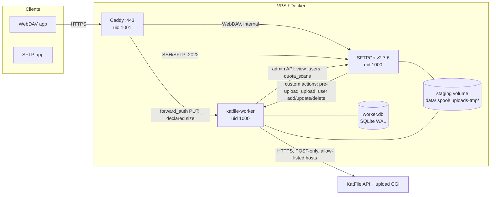

# Architecture

## Components and trust boundaries



| Network | Members | Purpose |
|---|---|---|
| `web_edge` | Caddy | Published 80/443 (loopback unless approved), ACME |
| `sftp_edge` | SFTPGo | Published SFTP port and loopback-only admin port |
| `backend` (internal, fixed subnet) | Caddy, SFTPGo, worker | Hooks, admin API, WebDAV upstream; no internet route |
| `egress` | worker | KatFile only |

Caddy and SFTPGo share exactly one network (`backend`), so SFTPGo can trust
`X-Forwarded-For` from that subnet only and its defender sees real client addresses.

## Upload lifecycle

```mermaid
sequenceDiagram
  participant App as WebDAV/SFTP app
  participant C as Caddy
  participant G as SFTPGo
  participant W as Worker
  participant DB as SQLite
  participant K as KatFile
  App->>C: PUT /photos/a.jpg (Content-Length)
  C->>W: forward_auth (declared size, path; user creds stripped)
  W-->>C: 204 admitted / 507 refused
  C->>G: PUT (streamed)
  G->>W: pre-upload hook (sync)
  W-->>G: 200 (reservation claimed) / 403
  G->>G: write to uploads-tmp, rename into home when complete
  G-->>App: 201 Created  (staged, NOT archived)
  G->>W: upload hook (status=1, retried on 5xx)
  W->>W: hard-link snapshot spool/<job-id>, verify inode
  W->>DB: INSERT job (pending) — COMMIT
  W-->>G: 200
  W->>K: upload/server, then multipart stream
  W->>DB: file_code committed
  W->>K: set_folder, then account-scoped file/list
  W->>DB: archived (retain until +24 h)
  W->>W: after retention: remove visible copy + snapshot (inode-checked)
```

### Job state machine

| State | Meaning | Next |
|---|---|---|
| `pending` | queued (snapshot held) | `uploading`, `awaiting_principal`, `blocked` |
| `awaiting_principal` | account not provisioned / not allowed yet | `pending` when ready |
| `uploading` | persisted before the first byte; `upload_body_sent_at_ms` set once the whole body was handed over | `remote_uploaded`, `retry_waiting`, `needs_review`, `failed` |
| `remote_uploaded` | `file_code` committed — never uploaded again | `assigning_folder` |
| `assigning_folder` / `verifying` | `set_folder`, then account-scoped listing | `archived`, `retry_waiting`, `needs_review` |
| `retry_waiting` | transient error, exponential backoff with jitter (30 s .. 1 h) | resumes at the right stage |
| `needs_review` | ambiguous upload, ownership not verified, snapshot changed, remote size mismatch | operator: retry / adopt / discard |
| `failed` | permanent error or retry limit | operator |
| `blocked` | account disabled or deleted before archival | re-enable (automatic) or operator |
| `archived` | verified; local copy retained until `retain_until_ms` ("Retained") | `cleaned` |
| `cleaned` / `discarded` | local copies removed | — |

Crash recovery: `uploading` without the body-sent marker is retried (the provider cannot
have stored an incomplete multipart body); with the marker it becomes `needs_review`
(`ambiguous_upload_crash`) and the reconciler adopts a unique remote match
(exact name + size, uploaded after the session was issued, not claimed by another job).

## Identity model

* SFTPGo is the source of truth for accounts; hooks only trigger a re-read through the
  admin API (`kfgw-worker`, permissions `view_users` + `quota_scans`).
* SFTPGo's SQLite user `id` is `INTEGER PRIMARY KEY` **without AUTOINCREMENT** and can be
  reused after deletion. A *principal* is therefore one account generation
  `(sftpgo_user_id, created_at)` with its own immutable UUID. At most one live principal
  per username; tombstones keep history.
* An upload belongs to the newest generation created before the event time, and is
  re-verified with SFTPGo after the event before any archival.
* Provisioning lists the parent folder, records a **folder intent** (same-named folders
  that already existed), then calls `folder/create`. An uncertain outcome is resolved by
  diffing a fresh listing against the intent; KatFile allows duplicate names, so blind
  retries are never made. An existing folder is never attached by name: a taken name gets
  a suffix (`alice-2`), explicit binding requires `POST /admin/principals/{id}/approve`.
* Deleting a user tombstones the principal, blocks its unstarted uploads, keeps its
  KatFile folder and files, and moves its home out of SFTPGo into
  `spool/deleted-homes/<principal>` (atomic rename). Verified archives there are cleaned
  immediately; the directory disappears once empty. If the username was re-created
  before the deletion was noticed, the shared home is split by inode change time
  (`ctime`, which clients cannot forge).

## File consistency: immutable snapshots + inbox policy

The plan required one tested approach instead of racy path reads. Findings that shaped it:

* SFTPGo overwrites (both WebDAV and SFTP, even in atomic mode) **truncate the existing
  inode in place**; truncation via SETSTAT also needs the `overwrite` permission.
* Linux `link()`/`rename()` work only within one mount, so the spool lives on the same
  volume as the homes.

Design: users get `list,download,upload,create_dirs,rename,delete` but **not**
`overwrite` (the worker blocks accounts that have `*`, `overwrite` or `create_symlinks`).
On the completion event the worker hard-links the file into `spool/<job-id>` through
directory file descriptors (`openat`/`linkat`, `O_NOFOLLOW` on every component) and
records `(dev, ino, size, mtime)`. Without `overwrite` nothing can modify that inode, so
deleting or renaming the visible file does not affect what is archived, and no second
copy of a 10 GB file is ever made. While a snapshot exists its inode cannot be reused,
which makes `(dev, ino)` an exact deduplication key for repeated hook deliveries.
The snapshot identity is checked before and after streaming.

Cleanup is TOCTOU-safe: a visible copy is renamed into `spool/quarantine`, compared by
inode, and only then unlinked; a different file is restored with `linkat` (which never
overwrites). Renamed copies are found by inode while the snapshot still pins it.

## Admission control (disk)

* WebDAV via Caddy: `forward_auth` sends the declared `Content-Length`; the worker refuses
  with **507 before any byte is staged** unless
  `free - reserved >= WORKER_MIN_FREE_BYTES + declared`, and reserves the size.
* SFTPGo `pre-upload` (all protocols, no size information): claims the proxy reservation
  for the same path, otherwise reserves `WORKER_UNKNOWN_UPLOAD_RESERVATION_BYTES`.
  Refusal is `403` (SFTPGo would retry a 5xx for minutes before denying).
* Hard cut-offs remain SFTPGo per-user quota and `max_upload_file_size`; atomic uploads
  delete partial files, and the worker sweeps temp files left behind by a killed SFTPGo.
* Under disk pressure, cleanup removes verified archives before their retention ends.

## Why SFTPGo custom actions instead of Event Manager HTTP actions

Both exist in the open-source 2.7 edition. Custom actions were chosen because their HTTP
client is the retryable one (Event Manager HTTP actions are sent once), the JSON body is
SFTPGo's own serialization (no template escaping), the configuration is plain environment
variables pinned in `compose.yaml`, and the bearer header is URL-scoped and injected from
`env.d` without storing secrets in the SFTPGo database. Event Manager's filesystem
actions explicitly do not run for user-delete events, so home clean-up lives in the worker.

## KatFile specifics

See [API_COMPATIBILITY.md](API_COMPATIBILITY.md). In short: every call is a POST with the
key in the body; errors are HTTP 200 with an application status; `fld_id` types vary;
names come back as Latin-1 mojibake; `set_folder` accepts foreign codes; an invalid
session stores files anonymously — hence ownership is only proven by the account-scoped
listing.

## Resource limits (per container)

| Service | Memory limit | Notes |
|---|---|---|
| SFTPGo | 512 MiB | Go heap ~15 MiB (`GOMEMLIMIT=200MiB`); the rest is page cache from buffered uploads. 256 MiB was OOM-killed in 2 of 3 local 10 GiB uploads |
| worker | 128 MiB | streaming client: 10 GiB upload → ~3 MiB RSS growth |
| Caddy | 128 MiB | 1 GiB upload through Caddy → ~20 MiB peak |

All containers run non-root with `cap_drop: ALL` (Caddy keeps only `NET_BIND_SERVICE`),
`no-new-privileges`, read-only root filesystems and rotated JSON logs.
